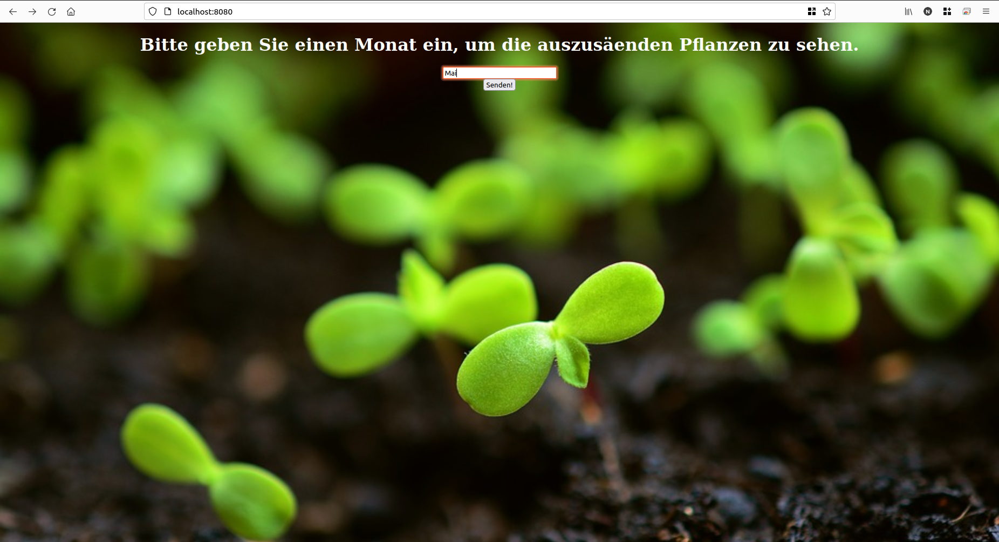
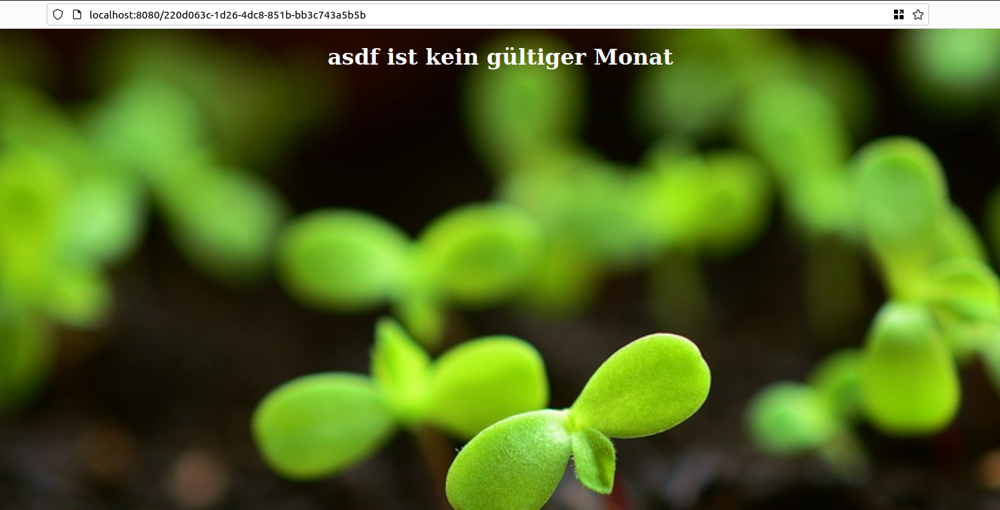

# sowing-calendar-clojure
A web app built in clojure with leiningen that gives list of seeds to sow in a given month

## How to run
### Prequisite
- Install [Clojure](https://clojure.org/guides/getting_started)
- Install [Leiningen](https://leiningen.org/)
### Start the app
- At project's root, execute ``lein run`` in your console terminal of choice. 
- Once the console output says ``System started``, the application is ready at http://localhost:8080
- Demo #1: input field
- 
- Demo #2: output for valid month
- 
- Demo #3: output for invalid month
- 
